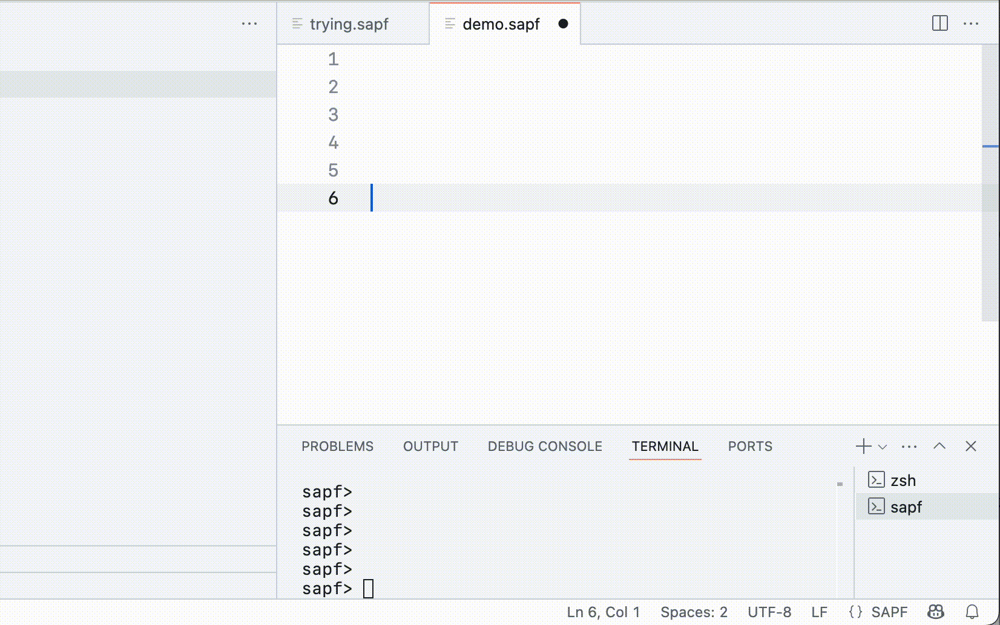

# SAPF Support for VS Code

This extension provides interactive support for working with the [sapf](https://github.com/lfnoise/sapf/) REPL. It comes "batteries included" and does not rely on any external setup.

### Features

* Commands for evaluating the current line, selection, code block (surrounded by configurable parentheses pair), or paragraph (text between empty lines)
* Function autocompletion and hover-based documentation with configurable information levels
* Built-in support for `stop`, `clear`, `cleard`, and `quit` commands
* Support for a custom prelude file
* Dynamic function definition regeneration from your SAPF installation
* Code formatting with automatic indentation and space normalization

There is also an excellent VS Code extension for `sapf` by [chairbender](https://github.com/chairbender/vscode-sapf). The main difference is that it relies on an external LSP server. While this approach has its benefits, it requires more setup effort.

### Default Shortcuts

* `Cmd+Enter` (Mac) / `Ctrl+Enter` (Windows/Linux): Evaluate the current line or selection
* `Shift+Enter`: Evaluate the current block, or the line/selection if no block is found
* `Cmd+Shift+Enter` (Mac) / `Ctrl+Shift+Enter` (Windows/Linux): Evaluate the current paragraph (text between empty lines)
* `Cmd+.` (Mac) / `Ctrl+.` (Windows/Linux): Stop sound
* `Cmd+Shift+.` (Mac) / `Ctrl+Shift+.` (Windows/Linux): Clear the stack
* `Cmd+Shift+I` (Mac) / `Ctrl+Shift+I` (Windows/Linux): Format code

### Code Formatting

The extension includes a built-in code formatter that helps maintain clean and consistent SAPF code.

#### Format Code
**Command**: `SAPF: Format Code`
**Shortcut**: `Cmd+Shift+I` (Mac) / `Ctrl+Shift+I` (Windows/Linux)

The formatter automatically:
- **Normalizes spacing**: Converts multiple spaces to single spaces
- **Indents brackets**: Properly indents content within parentheses, square brackets, and curly braces
- **Aligns comments**: Indents comments to match their surrounding code block
- **Preserves structure**: Maintains empty lines and overall code organization

The formatter respects SAPF's stack-based nature, keeping most code at the base level while only indenting content that's actually within brackets.

### Function Definition Management

The extension includes commands to manage function definitions for autocompletion and documentation:

#### Regenerate Function Definitions
**Command**: `SAPF: Regenerate Function Definitions`

This command generates fresh function definitions by running your SAPF installation with the `helpall` command. This is useful when:
- You've updated your SAPF installation and want the latest function definitions available in help and autocomplete
- You have a custom prelude file that adds new functions

**Usage**:
1. Open the Command Palette (`Cmd+Shift+P` on Mac, `Ctrl+Shift+P` on Windows/Linux)
2. Type "SAPF: Regenerate Function Definitions" and select it
3. If you haven't configured a prelude file path, you'll be prompted to either configure one or continue without it
4. The extension will generate new definitions and reload language features

**Note**: For complete function definitions, configure your prelude file path in settings (`sapf.preludePath`). This ensures all custom functions from your prelude file are included in autocompletion.

#### Remove Local Function Definitions
**Command**: `SAPF: Remove Local Function Definitions`

This command removes any locally generated function definitions and reverts to the default bundled definitions that describe default sapf functions, including `sapf-prelude.txt` that comes with it.

**Usage**:
1. Open the Command Palette (`Cmd+Shift+P` on Mac, `Ctrl+Shift+P` on Windows/Linux)
2. Type "SAPF: Remove Local Function Definitions" and select it
3. The extension will remove local definitions and reload with defaults

### Demo

### Inspiration

* [vscode-sapf](https://github.com/chairbender/vscode-sapf)
* [SAPF for NVIM](https://github.com/salkin-mada/sapf.nvim/tree/main)
* [TidalCycles for VS Code](https://github.com/tidalcycles/vscode-tidalcycles/tree/main)
